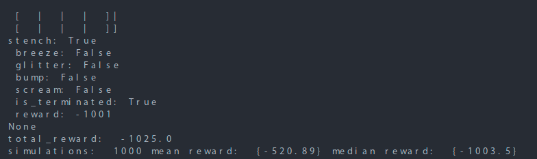
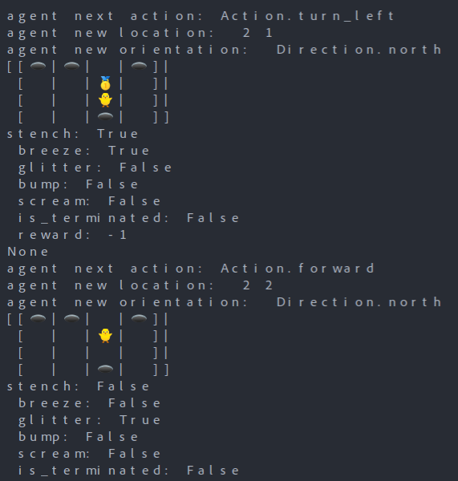
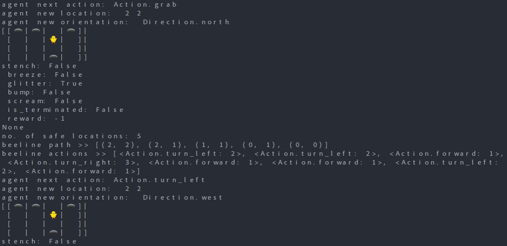
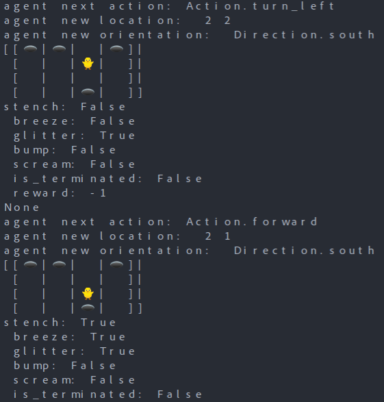
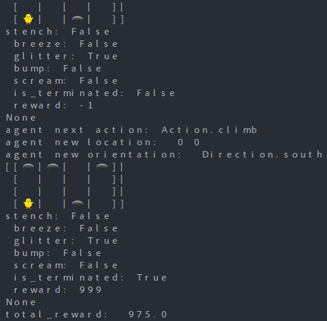

# Instructions

## Installation

```python
cd src/main/python/wumpus_world
pip install -r requirements.txt
python3 probabilistic_world.py
```

To obtain mean scores of a 1000 simulations:
```python
cd src/main/python/wumpus_world
pip install -r requirements.txt
python3 simulator.py
```

## Guide

- :hatched_chick: - Agent
- :space_invader: - Wumpus (Alive)
- :skull: - Wumpus (Dead)
- :hole: - Pit
- :1st_place_medal: - Gold

## Results

### Probabilistic Simulations
Mean scores of a 1000 simulations on multiple trials hovers between -500 and -570.



### Beeline
An example of a succesful run, agent climbs out from (0, 0) after grabbing the gold, and beelining for the exit.





..eventually after all beeline actions..

