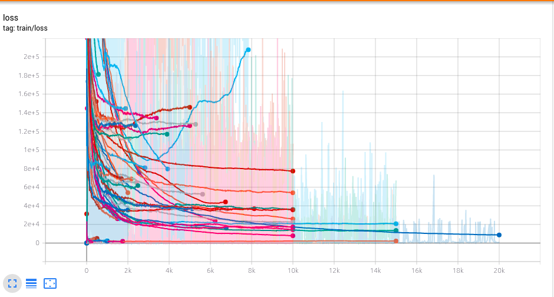
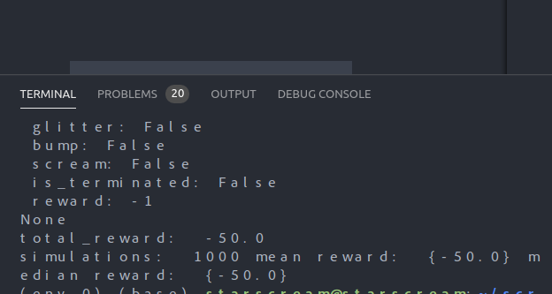

# Instructions

## Installation

```python
cd src/main/python/wumpus_world
pip install -r requirements.txt
python3 dqn_world.py
```
To train the model:
```python
cd src/main/python/wumpus_world
pip install -r requirements.txt
python3 dqn_train.py
```


To obtain mean scores of a 1000 simulations:
```python
cd src/main/python/wumpus_world
pip install -r requirements.txt
python3 simulator.py
```

## Guide

- :hatched_chick: - Agent
- :space_invader: - Wumpus (Alive)
- :skull: - Wumpus (Dead)
- :hole: - Pit
- :1st_place_medal: - Gold

## Results

### Simulations
The agent seems to get stuck in the local minima of the pair of actions `turn left + turn right` 
score: -50 in 50 moves.


