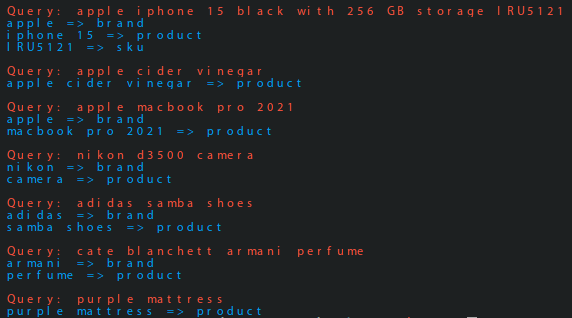
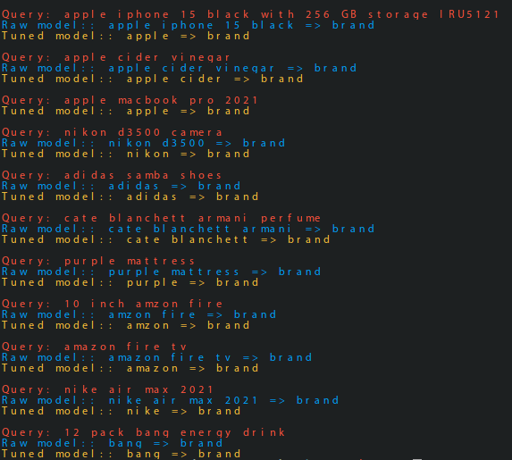

# General

## Named Entity Recognition (NER)

```python
python3 -m ner.sample --threshold=0.5
```




## Train

```python
python3 -m ner.preprocess
```

```python
python3 -m ner.train
```

### Measures

P: 88.79%       R: 95.00%       F1: 91.79%


