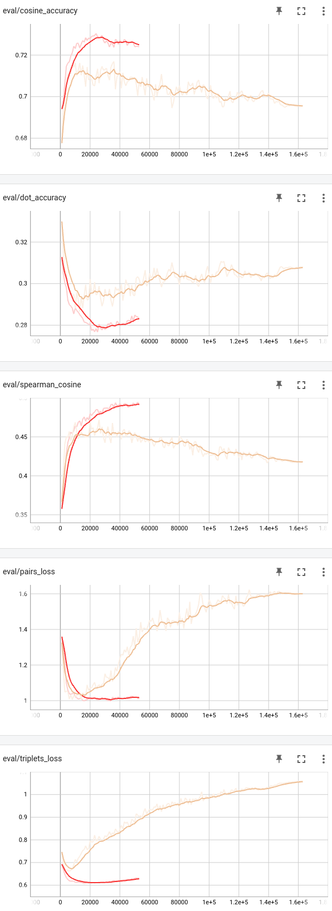

# Train

```bash
python3.10 -m train --n_samples 1_000_000
python3.10 -m torch.distributed.run --nproc_per_node=1 --nnodes=1 --master_port=12345 train.py --n_samples 1_600_000
 ```

## Plots




## Baseline Model
| Evaluator                     | Metric                      | Value  |
| ----------------------------- | --------------------------- | ------ |
| TripletEvaluator              | Accuracy Cosine Distance    | 0.7157 |
| TripletEvaluator              | Accuracy Dot Product        | 0.2870 |
| TripletEvaluator              | Accuracy Manhattan Distance | 0.7153 |
| TripletEvaluator              | Accuracy Euclidean Distance | 0.715 |
| InformationRetrievalEvaluator | Accuracy@10                 | 0.9580 |
| InformationRetrievalEvaluator | Precision@10                | 0.6738 |
| InformationRetrievalEvaluator | Recall@10                   | 0.5988 |
| InformationRetrievalEvaluator | MRR@10                      | 0.8994 |
| InformationRetrievalEvaluator | NDCG@10                     | 0.8064 |
| InformationRetrievalEvaluator | MAP@10                      | 0.7467 |
| EmbeddingSimilarity           | pearson_cosine              | 0.3986 |
| EmbeddingSimilarity           | spearman_cosine             | 0.3901 |
| EmbeddingSimilarity           | pearson_manhattan           | 0.3708 |
| EmbeddingSimilarity           | spearman_manhattan          | 0.3613 |
| EmbeddingSimilarity           | pearson_euclidean           | 0.3703 |
| EmbeddingSimilarity           | spearman_euclidean          | 0.3611 |